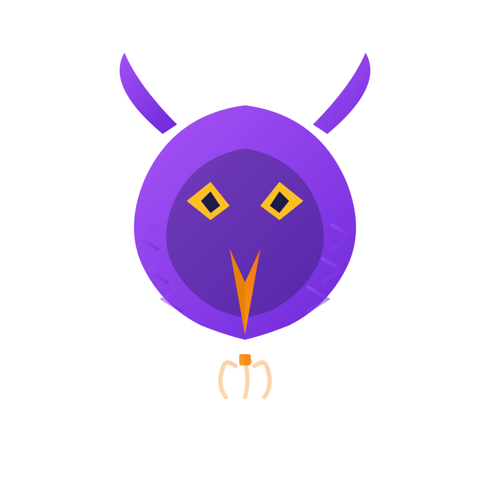

<div align="center">

<p>
  
</p>

<h1 style="border-bottom: none; margin-bottom: 20px;">Talon</h1>

**A terminal-based AI coding assistant with multi-provider support, screenshot analysis, and a full-featured TUI.**

[](https://www.docker.com/)

Run any AI model from your terminal — with tools for file editing, bash, search, fetch, vision analysis, LSP, MCP, and more. Built for developers who want a fast, local AI coding experience.

[Quick Start](#quick-start) · [Features](#features) · [CLI Usage](#cli-usage) · [Configuration](#configuration) · [Contributing](#contributing)

</div>

---

## Quick Start

### Native (macOS / Linux)

```bash
git clone https://github.com/chrisbeckett/talon.git
cd talon

# Set at least one API key
export ANTHROPIC_API_KEY=sk-ant-...
# or
export OPENAI_API_KEY=sk-...
# or
export OPENROUTER_API_KEY=sk-or-v1-...

# Build and run
bash scripts/install.sh
talon
```

### Docker

```bash
cd docker
docker compose up -d
```

---

## Features

| Feature | Description |
|---------|-------------|
| **Terminal UI** | Full-featured Bubble Tea TUI with sidebar, chat view, file tree, and session management |
| **Multi-provider** | OpenAI, Anthropic, OpenRouter, Google Gemini, Groq, DeepSeek, Ollama, and more |
| **File editing tools** | View, write, edit, multi-edit files with LSP integration |
| **Bash tool** | Run shell commands with permission management and sandboxing |
| **Search tools** | Glob, grep, ripgrep, web search, and sourcegraph code search |
| **Fetch tool** | Fetch web pages and convert to markdown |
| **Screenshot capture** | Capture your screen and analyze it with AI |
| **Vision analysis** | Local MiniCPM-V integration for image/document analysis via Ollama |
| **MCP server support** | Connect Model Context Protocol servers for expanded tool capabilities |
| **LSP integration** | Language Server Protocol integration for diagnostics and references |
| **Skills system** | Extensible skill-based tool loading |
| **Sub-agents** | Delegate tasks to specialized sub-agents |
| **Session management** | Persistent conversation history with automatic summarization |
| **Context-aware** | Automatic context management with token tracking and memory tree compression |
| **Client/Server mode** | Run as a daemon on a Unix socket with HTTP/SSE streaming |
| **Hooks system** | Gate, approve, or rewrite tool calls before execution |
| **CVE database** | Built-in CVE vulnerability search and tracking |
| **Token optimization** | Response caching, token optimization, and context compression |
| **Docker support** | Containerized deployment with docker-compose |

---

## CLI Usage

```bash
# Start the TUI
./talon

# Direct prompt
echo "list all go files in this project" | ./talon
```

Once in the TUI:
- **`Ctrl+P`** — Open command palette
- **`Ctrl+D`** — Toggle details panel
- **`Ctrl+N`** — New session
- **`Tab`** — Switch focus between editor and chat

---

## Configuration

Configuration is stored in `~/.talon/talon.json`. The first run will guide you through provider setup.

### Vision Model Setup (Optional)

For screenshot analysis and image understanding with models that don't support vision natively:

```bash
# Install MiniCPM-V via Ollama
ollama run minicpm-v
```

Configure in `talon.json`:
```json
{
  "tools": {
    "vision": {
      "endpoint": "http://localhost:11434/v1/chat/completions",
      "model": "minicpm-v"
    }
  }
}
```

No configuration needed for natively vision-capable models (Claude, GPT-4o, Gemini).

## Supported Providers

| Provider | API Key |
|----------|---------|
| **Anthropic** | `ANTHROPIC_API_KEY` |
| **OpenAI** | `OPENAI_API_KEY` |
| **OpenRouter** | `OPENROUTER_API_KEY` |
| **Google Gemini** | `GEMINI_API_KEY` |
| **Groq** | `GROQ_API_KEY` |
| **DeepSeek** | `DEEPSEEK_API_KEY` |
| **Mistral / Codestral** | `MISTRAL_API_KEY` / `CODESTRAL_API_KEY` |
| **Azure OpenAI** | `AZURE_OPENAI_API_KEY` (with endpoint) |
| **AWS Bedrock** | AWS credentials |
| **Ollama** (local) | None (runs locally) |
| **llama.cpp / LM Studio** | None (runs locally) |
| **Talon** | `OPENCODE_API_KEY` |
| **Fireworks AI** | `FIREWORKS_API_KEY` |
| **Cerebras** | `CEREBRAS_API_KEY` |
| **NVIDIA NIM** | `NVIDIA_NIM_API_KEY` |
| **Kimi / Moonshot** | `KIMI_API_KEY` |
| **Z.AI** | `ZAI_API_KEY` |
| **Wafer** | `WAFER_API_KEY` |

Set API keys in `~/.talon/.env`:
```env
ANTHROPIC_API_KEY=sk-ant-...
OPENAI_API_KEY=sk-...
OPENROUTER_API_KEY=sk-or-v1-...
```

---

## Project Structure

```
talon/
├── ai/                   # AI application monorepo
│   └── packages/
│       ├── talon/        # Main Talon application (TypeScript/Effect)
│       ├── server/       # HTTP API library
│       ├── core/         # Core data layer
│       ├── cli/          # CLI commands
│       └── ...           # Other packages
├── tui/                  # OpenTUI terminal rendering framework (fork)
├── native/               # Zig native rendering core
├── scripts/              # Build and install scripts
└── .claude/              # Project configuration
```

---

## Contributing

Talon is in active development. Contributions are welcome.

### Development

```bash
cd ai/packages/talon && bun run src/index.ts  # Run from source
```

### Areas to Help

- 🧪 **Test providers** — Configure different providers and report issues
- 🐛 **Bug reports** — Include model, error message, and reproduction steps
- 🔧 **New tools** — The tool system is extensible; add your own tools
- 🎨 **UI improvements** — The TUI is built with Bubble Tea; contributions welcome
- 📖 **Documentation** — Improve docs, add examples

---

## License

MIT License. See [LICENSE](LICENSE) for details.
